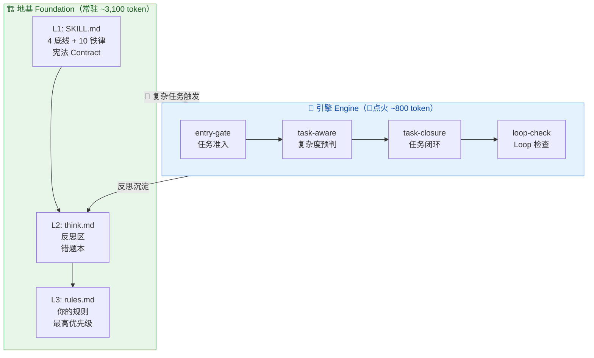

# sofagent

中文 | [English](README.en.md)

[](./LICENSE)
[](./HANDBOOK.md)
[](./README.md)
[](./ARCHITECTURE.md#平台依赖)
[](./ARCHITECTURE.md#平台依赖)
[](https://github.com/KongFangXun/sofagent/stargazers)


<!-- TODO: demo.gif — 15s 左右对比: 裸 Agent 跑偏 vs sofagent 约束后正常 -->

> sofa + agent = 沙发特工——希望有一天，我们能躺在沙发上，Agent 就把活干完了。
> v0.83 · 2026-06-22

> 📄 **License**：MIT。代码、文档、模板——随便用，保留版权声明就行。

我叫孔放勋，一个完全不懂代码的产品经理。所有设计决策来自大半年的真实使用经验，文档由 [DeepSeek V4 Pro](https://api-docs.deepseek.com/zh-cn/) 和 [GLM-5.2](https://z.ai/) 配合生成。欢迎大佬进来改。

---

## 这是什么

当你的 Agent 反复偏离目标、任务越做越复杂、刚踩过的坑下次还踩——sofagent 能约束其行为、拆解复杂任务、从错误中沉淀教训。

给 Agent 配了个「指导员」：不是让它更聪明，是让它别乱来。

| 角色 | 怎么干 |
|------|------|
| **Skill**（判断）| MD 文件当规则书，Agent 加载后照做——三层加载链、复杂度预判、反思沉淀 |
| **脚本**（执行）| bash 脚本处理机械活——读写文件、调 API，Agent 调 shell 跑（非 bash 平台降级为 Read/Edit 工具） |
| **平台兜底**| 加载链 + 断路器 + 死循环检测——OpenClaw 系由 Hook 和配置层兜底，其他平台依赖自身安全机制 |

> ⚠️ sofagent 是软约束层——靠 Agent 读取并自觉遵守，不是硬编码强制执行。执行率受上下文长度、模型能力影响。详见 [LIMITATIONS.md](./LIMITATIONS.md#known-limits)。

---

## 三份文档

| 你是谁 | 看哪个 | 一句话 |
|------|------|------|
| 普通用户 | [HANDBOOK.md](./HANDBOOK.md)（443 行） | 怎么装、怎么用、什么是铁律 |
| 开发者 | [DEVELOPMENT.md](./DEVELOPMENT.md)（599 行） | Skill 怎么协同、编排怎么跑、反思怎么闭环 |
| 设计爱好者 | [ARCHITECTURE.md](./ARCHITECTURE.md)（596 行） | 为什么选这些设计、已知局限 |
| 技术 VP 推广 | [docs/team-deploy.md](./docs/team-deploy.md)（3 页） | 装、试、回顾三阶段落地指南 |

---

## 怎么工作

| 做什么 | 怎么做 |
|------|------|
| **地基** | 三层加载链——宪法（4底线+10铁律）→ 反思区（自动错题本）→ 你的规则。整个会话期间永远在线 |
| **引擎** | 任务编排引擎——🔴 复杂任务时点火，智能拆解 + Loop 检查 + 闭环反思 |
| **进化** | 渐进减薄——同类任务根据历史成功率调整编排深度，跑崩了恢复完整编排 |

> 💡 核心理念：**厚在治理，薄在复用。** 约束自己定，模板和 Skills 从社区取。为 AI Agent 提供纪律层与反思循环（效果待社区验证）。
> 💰 安装成本：约 3,000 token 地基常驻（128K 窗口的 2.5%）。编排引擎仅 🔴 复杂任务时额外 ~800 token。详见 [Token 预算](./HANDBOOK.md#token-预算参考)。

### 架构总览



> ⚠️ **已知局限**：核心效果尚无第三方实测数据；复盘是 LLM 自评，无客观基准；Loop Agent 非独立进程；纯文件约束依赖 Agent 配合；数据明文存储（task/logs + think.md 含任务记录，无加密）；不是多用户系统（共享 .sofagent/ 会交叉污染经验）。详见 [LIMITATIONS.md](./LIMITATIONS.md#known-limits)。

## 平台能力

| 平台 | 加载链 | 编排引擎 | 自动化程度 |
|------|------|------|------|
| OpenClaw | 第 1 层 Hook 注入，第 2/3 层 Agent 自觉（有 Hook 辅助提醒）| ao compose 完整可用 | 高 — 安装即生效 |
| WorkBuddy | 第 1 层 @skill 注入，第 2/3 层 Agent 自觉 | ao compose 可用（需 npm 安装）| 中 — 需手动 @skill:sofagent |
| Codex / Hermes Agent / Claude Code | 第 1 层通过种子指令加载，第 2/3 层 Agent 自觉（无机制保障）| 不可用（降级为手工拆解）| 低 — 核心约束仍生效，编排引擎缺失 |

> ⚠️ 以上为作者实测结论。如果你在某个平台上跑出了不同的结果——**那才是真实数据**，欢迎告诉我们。

> ⚠️ **治理加固约束级别**：步数闸 / 熔断闸 / 幂等检查均为 prompt 级软提醒，非进程级硬拦截——Agent 可能跳过。OpenClaw 上 Hook 可升级为硬拦截。各平台实测数据见 [platform-matrix.md](./docs/platform-matrix.md)。

> ⚠️ **非 OpenClaw 平台预期管理**：编排引擎 / Hook / 断路器三项核心能力仅 OpenClaw 全绿。如果你不用 OpenClaw，sofagent 对你的价值约为完整版的 30%（只有宪法层约束生效）。这不是 bug，是架构宿命——v0.8 daemon 会改善加载链，但编排和 Hook 仍是 OpenClaw 专属。详见 [LIMITATIONS.md 平台依赖](./LIMITATIONS.md#平台依赖)。

> 📎 「种子指令」是什么：写在 Agent 记忆文件（如 CLAUDE.md / AGENTS.md / SOUL.md）里的一句话，告诉 Agent 启动时先读 sofagent 约束文件。**这不是自动化——是人手动贴的纸条。** OpenClaw 和 WorkBuddy 通过各自的 skill 机制自动加载，不需要种子指令。

## 实际效果

> **效果？我们诚实地说不知道。** 目前仅有作者自己的日常使用感受，没有第三方长期数据。v0.72 新增了 benchmark.sh 可复现对比测试——欢迎你跑一下，然后把结果告诉我们。

> 详见 [EVIDENCE.md](./docs/EVIDENCE.md)——社区用户的实际使用数据。

---

## 不是什么

- ❌ 不是 AI 框架——不管模型 API、不写 prompt，那是 Model 层的事
- ❌ 不是 Skills 商店——不维护可复用 Skills（内置 task-aware 等核心治理 Skill 除外），外部 Skills 从社区获取
- ✅ 是一套**治理方法**——靠 Skill + 脚本 + 配置三层落地，告诉 Agent 什么能做、什么不能做、什么时候该收手。OpenClaw first，其他平台仅宪法层约束（详见 [LIMITATIONS.md 平台依赖](./LIMITATIONS.md#平台依赖) 能力表）

---

## Quick Start

> 选你的平台，5 步，10 分钟。

### 🚀 安装（两步）

```bash
git clone https://github.com/KongFangXun/sofagent.git
cd sofagent && bash sofagent/scripts/install.sh
```

> 自动探测平台。也可以用一行命令（`curl -fsSL ... | bash`），但企业环境推荐 git clone——代码可审计。

如果你已安装 ClawHub CLI 或 SkillHub CLI，一行命令即可：

```bash
# ClawHub
clawhub skill install KongFangXun/sofagent

# SkillHub
skillhub install sofagent
```

> 💡 没有 ClawHub CLI？继续往下走 git clone 安装流程，一样简单。

### 1. 前置依赖

| 依赖 | 版本要求 | 为什么需要 | 检查命令 |
|------|------|------|------|
| bash | ≥4 | install.sh / task-record.sh | `bash --version` |
| git | 任意 | clone 仓库、task/logs 追溯、worktree 隔离 | `git --version` |
| node | ≥18 | `ao compose` 编排引擎（agency-orchestrator）| `node --version` |
| npm | ≥9 | 全局安装 agency-orchestrator | `npm --version` |

> ⚠️ WorkBuddy 用户若不跑编排引擎（只用宪法层约束），node/npm 可不带。OpenClaw / Codex / Hermes Agent / Claude Code 跑复杂任务（🔴）必须有 node + npm。

> ⚠️ **编排引擎依赖第三方 npm 包 `agency-orchestrator`**。若 npm install 失败或未配置 API Key，编排引擎降级为 Agent 手工拆解（模板匹配和角色分配不可用）。约束层不受影响。

### 2. 安装

```bash
bash sofagent/scripts/install.sh --platform 你的平台
```

| 平台 | 命令 | 说明 |
|------|------|------|
| **OpenClaw** | `bash sofagent/scripts/install.sh` | 自动探测，完整部署（宪法 + Hook + 断路器） |
| **WorkBuddy** | `bash sofagent/scripts/install.sh --platform workbuddy` 或通过技能市场安装 | 部署 SKILL.md 到 `~/.workbuddy/skills/sofagent/` |
| **Claude Code** | `bash sofagent/scripts/install.sh --platform claude` | 部署宪法 + 输出种子指令（需手动粘贴到 CLAUDE.md） |
| **Codex** | `bash sofagent/scripts/install.sh --platform codex` | 部署宪法 + 输出种子指令（需手动粘贴到 AGENTS.md） |
| **Hermes Agent** | `bash sofagent/scripts/install.sh --platform hermes` | 部署宪法 + 输出种子指令（需手动粘贴到 SOUL.md） |

> 未指定 `--platform` 时自动探测。install.sh 会根据平台写入对应目录（OpenClaw→`~/.openclaw/skills/`，WorkBuddy→`~/.workbuddy/skills/`，其他平台输出种子指令）。

### 3. 30 秒 smoke test

```bash
bash sofagent/scripts/verify.sh
```

> 预期：9 类 24+ 检查项全 pass。加 `--json` 可集成到 CI/CD。如果 fail，看 [Handbook §六](./HANDBOOK.md#六常见问题) 排查。

### 4. 跑第一个任务

打开你的 Agent 客户端，试一个需要多步拆解的任务（这样才能看出 sofagent 的编排能力）：

> `/goal` 是 Claude Code 的自主执行命令；OpenClaw 用户可直接描述复杂任务，Agent 会自动触发编排引擎。详见 [Handbook §四](./HANDBOOK.md#四任务目标制定)。

```
/goal 帮我分析一下这个项目的代码质量，生成一份改进建议报告
```

Agent 会自动拆解任务 → 匹配 Skill → 执行 → 反思沉淀。在 OpenClaw 上全程自动；在其他平台部分能力需手动触发（详见 [LIMITATIONS.md 平台依赖](./LIMITATIONS.md#平台依赖) 能力表）。

跑完看结果：

```bash
ls .sofagent/task/logs/        # 按「年-月」分目录的执行日志
cat .sofagent/think.md         # Agent 自动提炼的反思摘要
```

OpenClaw 上全自动，其他平台需手动触发闭环。

---

**跑通了？** [HANDBOOK.md](./HANDBOOK.md) 教你怎么调，[DEVELOPMENT.md](./DEVELOPMENT.md) 讲内部怎么跑，[ARCHITECTURE.md](./ARCHITECTURE.md) 说为什么这么设计。想看这个项目怎么开发的？[开发日志](./docs/changelog/) 是作者的 dogfooding 实录。

---

## 项目结构

```
sofagent/                  ← 核心部署文件（SKILL.md 主入口 + 5 子 Skill + 脚本 + hook）
├── README / HANDBOOK / DEVELOPMENT / ARCHITECTURE / ROADMAP.md  ← 文档
├── docs/                  ← EVIDENCE / TESTING / changelog / cases
```

安装后自动生成 `.sofagent/`（think.md 反思 + task/logs 审计 + orchestrator/ 配置），每次任务自动记录，跨任务反思沉淀。

---

## 用了哪些外部项目

| 依赖 | 干什么 |
|------|------|
| [OpenClaw](https://github.com/openclaw/openclaw) | Agent 运行时——加载链、Hook、Session 管理 |
| [agency-orchestrator](https://github.com/jnMetaCode/agency-orchestrator)（Apache-2.0） | 任务编排引擎——`ao compose` 一行拆任务、匹配角色 |
| [agency-agents-zh](https://github.com/jnMetaCode/agency-agents-zh) | 215 个中文岗位模板 |
| [ClawHub](https://clawhub.ai) / 各平台技能市场 | 外部 Skills 的发现来源——不内置，按需从社区获取 |

---

## 贡献

欢迎提 Issue 和 PR，尤其是挑刺的那种。详见 [CONTRIBUTING.md](./CONTRIBUTING.md)。

> 🧑‍💻 **我们在寻找 Co-maintainer**——特别是熟悉 bash BSD/macOS 兼容性、OpenClaw hook(TS)、安全审计或英文文档的人。从第一个 PR 开始，贡献自然累积，作者主动邀请。详见 [CONTRIBUTING.md § Seeking Co-maintainers](./CONTRIBUTING.md#seeking-co-maintainers)。

---

## 致谢

- [OpenClaw](https://github.com/openclaw/openclaw) by Peter Steinberger — sofagent 的基石
- [DeepSeek V4 Pro](https://api-docs.deepseek.com/zh-cn/) + [GLM-5.2](https://z.ai/) — 所有文件由二者配合生成
- [Andrej Karpathy Skills](https://github.com/multica-ai/andrej-karpathy-skills) — 4 条编码原则是 10 则铁律的根基
- [agency-orchestrator](https://github.com/jnMetaCode/agency-orchestrator) + [agency-agents-zh](https://github.com/jnMetaCode/agency-agents-zh) — 任务编排引擎 + 中文岗位库
- [Anthropic Skills](https://github.com/anthropics/skills) + [Managed Agents](https://www.anthropic.com/engineering/managed-agents) — SKILL.md 格式规范 + 四层架构哲学源头
- [Loop Engineering](https://addyo.substack.com/p/loop-engineering) by Addy Osmani — 循环工程五大件，编排层理论源头
- [superpowers](https://github.com/obra/superpowers) — Skill 作为 Harness 杠杆的思路
- [SkillOpt](https://arxiv.org/abs/2605.06614) by Microsoft Research — Skill 文档训练方法论，启发 v0.9 Skill 自进化
