# 路线图 · Roadmap

> 已经做了什么、未来要去哪、哪些地方需要你的帮助。
> v0.83 · 2026-06-22 · v0.9 规划中

---

## 目录

- [**现在在哪：v0.83**](#现在在哪v083) — 能用的、还不太行的、三个债
- [**迭代历程**](#迭代历程) — v0.1 → v0.83，一路怎么走来的
- [**未来去哪**](#未来去哪) — v0.9 → v1.0 → v2.x，方向不是承诺
- [**探索方向**](#探索方向来自-v081-评审值得想但不着急做) — CI/CD Gate / Lite / 审计报告
- [**不需要的**](#不需要的) — 想过但决定不做的事
- [**欢迎参与**](#欢迎参与) — 你能帮什么

---

## 现在在哪：v0.83

**能用的**：
- OpenClaw 上，Agent 能读到宪法（4底线+10铁律），复杂任务会自动拆解，跑完会自我复盘
- 日志会脱敏（写进文件前帮你把 API Key 打码），过期数据会清理——虽然触发方式是 `RANDOM % 10` 概率触发，不是定时任务
- `install.sh` 一个命令装好（`git clone` 为推荐路径，也支持 `curl pipe bash`），`verify.sh` 告诉你装好没有（`--quick` 快速模式）；加载链自检声明 + 人类抽样审计也已内置
- **daemon 已跑通**：后台进程能运行、能监控 think.md / rules.md hash 变化、能自动更新 daemon.json + 写 daemon-notice.md——macOS (launchd) 和 Linux (systemd) 已支持，Windows 宪法层仍可用
- **治理加固已标注约束级别**：engine.md / loop-check.md 每项治理加固前标 `[软约束·全平台]`，技术负责人一眼区分 prompt 级提醒 vs 机制保障
- **最小可信验证器**：`verify-evidence.sh` 扫描 task/logs 检查有无客观证据（测试 exit code / lint 结果）

**还不太行的**：
- **加载链靠 Agent 自觉**。OpenClaw 上有 Hook 强制注入，4底线+10铁律一定生效。v0.82 实测确认：WorkBuddy/Codex/Hermes Agent 靠主动触发或搜索加载，命中率不定。这不是 bug，是架构宿命：没有 Hook 的平台，我们控制不了
- **治理加固仅在 OpenClaw 生效**：v0.82 五平台实测确认——步数闸 / 熔断闸 / 幂等检查 / 评判器隔离在 WorkBuddy / Codex / Hermes Agent 上全部降级或失效。文档已诚实标注，不模糊标 ⚠️
- **数据是明文的**。`.sofagent/` 下面的反思、日志、评分——谁有文件系统权限谁就能读。我们在 SECURITY.md 里诚实写了
- **编排引擎是外部依赖**。`ao compose` 是一个 npm 包，不在我们仓库里。离线/内网环境用不了——有 `--no-ao` 降级，但等于放弃了编排能力
- **效果没数据**。我们说「减少 token 浪费」「降低偏离率」——都是定性感受，没有 A/B 对照。「Agent 有没有跑偏」本身就很难量化

**最大的三个债**：
1. ~~**daemon + 治理加固**~~：✅ v0.81 已完成 + v0.82 约束级别标注 + 最小消费动作 + 可信验证器
2. **企业级**：加密、审计、多用户、批量部署——现在最多算「单人试用」
3. ~~**跨平台实测**~~：✅ v0.82 已完成 5/5 平台。实测数据见 [docs/platform-matrix.md](./docs/platform-matrix.md)

**评审待办（v0.82 双视角评审，2026-06-22）**：

> 以下不是代码改动，是**项目动作清单**——决定项目能否从「概念验证」走到「值得推荐」。

| 优先级 | 动作 | 截止 | 来源 |
|:------:|------|------|------|
| P0 | A/B benchmark 数据（10 任务 × 带不带 sofagent，含 token / 调用次数 / 循环状态） | 2 周内 | 评审 |
| P1 | demo.gif（加载链注入 / 编排拆解 / 闭环反思 3 段） | v0.9 前 | 评审 |
| P1 | daemon 端到端验证 case（A 踩坑 → daemon 记录 → B 避坑） | v0.9 前 | 评审 |
| P1 | 「越用越聪明」量化（第 1 次 vs 第 10 次 token + 错误率趋势） | v0.9 前 | 评审 |

---

## 迭代历程

### 治理核心（v0.1 ~ v0.4）

| 交付物 | 说明 |
|------|------|
| **4 底线 + 10 铁律** | 宪法层，定义 Agent 不可逾越的行为边界 |
| **Loop Agent** | checkpoint / failure / closure 三层循环，每次任务跑完自动复盘 |
| **三层闸门** | 入境 → 每任务 → Loop → 离境，全生命周期拦截 |
| **渐进减薄编排** | 跑顺减步骤、跑崩加回来，AO compose + 滑动窗口回滚 |
| **think.md 反思区** | 持久化跨 session 经验积累 |
| **scoring 技能记录** | 按使用频率动态调整 Skill 信任等级 |
| **task-orchestrate 脚本引擎** | 复杂任务自动拆解为 L1~L4 编排深度 |
| **seed-plan 种子指令方案** | 最小化加载链（SKILL.md（宪法内联）→ think.md → rules.md），~3,100 token 地基 |

### 企业级能力（v0.5x）

| 交付物 | 说明 |
|------|------|
| **install.sh / uninstall.sh** | 一键安装卸载，装得上卸得干净 |
| **离线模式** | engine.md + rules.md 提示 Agent 优先本地工具、离网降级 |
| **跳过 ao 全局安装** | `--no-ao` 参数，企业内网无需外部依赖 |
| **编排 fallback** | task-orchestrate.sh 失败时 exit 0 降级，不阻塞 Agent |
| **企业部署文档** | docs/enterprise-deploy.md |
| **.sofagent/ 权限加固** | install.sh chmod 700，非 root 无法读取治理数据 |
| **配置注入开关** | `--no-config-inject` 参数，禁止向 Agent 注入外部配置 |

---

### v0.6x — 质量加固 ✅

| 想法 | 难度 | 现状 |
|------|:--:|------|
| **新会话端到端测试** | 🧑‍🎓 | ✅ OpenClaw + WorkBuddy 已验证——加载链→预判→执行→闭环反思全链路通过。已有 2 人完成 0→1 体验（docs/EVIDENCE.md） |
| **端到端闭环验证** | 🧑‍🎓 | ✅ task/logs → think.md → scoring/ → orchestrator/ 完整数据流验证写入正确 |
| **WorkBuddy 专家团共存** | 🔧 | ✅ 🟢🟡 任务和平共处；🔴 复杂任务双重编排冲突——SKILL.md A0 加引擎自检，设计边界已文档化 |
| **load-chain.sh 权重折半** | 🔧 | ✅ `[LLM自评]` 标记动态降权（×0.5）。OpenClaw 物理降权生效；其他平台靠 Agent 自觉识别 |

> 🧑‍🎓 = 新手友好 / 🔧 = 需要经验

> ⚠️ **v0.60 发布自检发现：加载链步进脆弱性。** Agent 声称"跑了 sofagent"，实际只读了 1/3。v0.61 四项改进后 WorkBuddy 新会话仍然跳步——证实 SKILL.md 层面改不动，强制力只能来自外部 Hook。v0.64 起 OpenClaw 通过内部 hook 实现强制注入；合规三件套于 v0.70.0 落地。

### v0.7x — 企业合规 ✅

| 想法 | 类别 | 说明 |
|------|:--:|------|
| **数据保留策略** | 合规 | cleanup.sh 自动清理——按保留天数/条数上限，清理前 tar.gz 归档 |
| **task/logs 脱敏** | 合规 | sanitize() 脱敏管道——API Key / 密码 / 手机号写入前打码，内网 IP 可选 |
| **审计日志** | 合规 | task-record.sh 独立审计日志 + task/logs 追溯双通道，默认关闭向后兼容 |

---

### v0.72 — 门面实证

> v0.71 修了代码里「宣称有但没实现」的功能。v0.72 修 README 里「说有但做不到」的宣称 + 给效果一个可复现的基准。不碰运行时逻辑。
>
> 详细开发日志见 [docs/changelog/v0.72.md](./docs/changelog/v0.72.md)

| 交付物 | 类别 | 说明 |
|------|:--:|------|
| **README 平台能力表重构** | 诚信 | 「支持五大平台」→ 每平台实测能力差异表（加载链 / 编排引擎 / 自动化程度） |
| **benchmark.sh** | 实证 | 10 个标准化任务 × 带不带 sofagent 对比。半自动——生成 prompt，人跑 Agent，脚本记录结果。任何人可复现 |
| **EVIDENCE 重构** | 诚信 | 从「等你来填」空表格 → 「我们自己先出数据」。新增持续使用列 + 基准测试区 |
| **anti-cases 反案例目录** | 诚信 | 全 PASS 比没数据更损害信誉。建标准模板，v0.72 测试中产生第一份真实反案例 |
| **handler.ts 回归验证** | P0 | v0.71 修了第 3 层 silently 失效的 bug——v0.72 在 ≥3 个 OpenClaw 版本上验证修复真的生效 |
| **ao compose 依赖加固** | P1 | 版本 pin + vendor snapshot + verify.sh 健康检查。不只是文档化 |
| **engine.md 降级能力清单** | P2 | ao compose vs 默认编排的 5 项能力差异对照表 |

**不包含**：think.md 记忆三规则、scoring 判断力维度、任务闸执行层——全是运行时逻辑改动，推到 v0.73。

---

### v0.73 — 运行时逻辑加固

> v0.72 修了门面，v0.73 修运行时。三道闸门体系落地 + 编排引擎加固 + 记忆系统最小闭环 + 安装门槛降低。
>
> 来自技术 VP 评审 + 两份行业研究笔记（循环工程师 / Cloud Code Workflows）。

| 交付物 | 类别 | 说明 |
|------|:--:|------|
| **任务闸执行层** | 闸门 | engine.md 加硬检查——🔴 点火前必须显式输出准入检查 PASS/REJECT，Agent 不能跳过 task-aware §1.1 直接开干 |
| **执行闸权限边界** | 闸门 | entry-gate.md 加权限边界声明字段——不只注册「能做什么」，也声明「绝对不能做什么」 |
| **验收闸 checklist** | 闸门 | loop-check.md 加结构化 5 项 checklist + 四维度排查（输入/环境/工具/模型）+ 防雪崩说明 |
| **记忆三规则** | 记忆 | think.md 写入标准（≥2 次重复或可验证后果才写）+ 合并规则（同标签压缩）+ 遗忘规则（30 天降权 / 60 天归档） |
| **scoring 判断力维度** | 指标 | 第九维——弃权率。拒绝高风险任务计正分。从「多跑多成」到「该停就停」 |
| **编排引擎加固** | 引擎 | engine.md 检查点定义 + 显式失败分支（6 个场景）+ task-aware 停止条件字段 + --max-retries |
| **ComplexityScorer 模型路由** | 引擎 | 50 行确定性公式：总分 = 子任务数×0.4 + 跨领域数×0.3 + 预估 token×0.2 + 含代码/报告×0.1。≥0.5 → ao compose (Pro)；<0.5 → Flash 或默认编排。engine.md A3 段 + task-orchestrate.sh `--model` 参数 |
| **rules.md 升级** | 规范 | 从「自定义规则」→「Agent 运行规范」——含项目目标、验收标准、风险边界、停止条件 |
| **安装门槛降低** | 体验 | 当前 4 步安装 → 目标 2 步（一 URL + 一命令）。打通 ClawHub/SkillHub 发布流程 |
| **constitution/ 扁平化** | 重构 | `constitution/rules.md` → `rules.md`。目录只剩一个文件是历史遗留——用户改规则不用钻两层目录。install.sh 自动迁移旧路径 |
| **ROADMAP ASCII → Mermaid** | 视觉 | 移动端渲染正常 |

**行业研究来源**：
- 循环工程师笔记 → 循环契约概念、触发器系统（daemon 定位的理论基础）
- Workflows 笔记 → 可观测性产品化（TOI 仪表盘参考）
- 两条笔记的详细洞察写进 ARCHITECTURE.md §五

---

### v0.74 — 治理层自身治理

> v0.72 修了门面，v0.73 修了运行时，v0.74 修治理层自己的文档臃肿、可信度缺口和易用性短板。不碰运行时逻辑。
>
> 来自第三方评审（前 GitHub 维护者 + 技术 VP）：「设计精良的概念验证」→ 往「可以放心推荐」走一步。

| 交付物 | 类别 | 说明 |
|------|:--:|------|
| **文档拆分** | 结构 | ARCHITECTURE §五 → docs/research/industry-insights.md；ROADMAP daemon 详细设计 → 指向 docs/daemon-design.md |
| **benchmark.sh API 模式** | 实证 | 新增 `--api` 全自动路径（OpenClaw 非交互模式），减少人肉依赖 |
| **EVIDENCE 最小模板** | 实证 | 3 个数字 + 1 句话模板，填完不超过 1 分钟 |
| **ao compose 格式文档** | 加固 | YAML 格式写死 + task-orchestrate.sh 自动降级（不只是口头告知） |
| **加载链自检声明** | 约束 | SKILL.md 加 L1/L2/L3 自检，缺失时提醒用户 |
| **人类抽样审计** | 约束 | 每 10 次闭环标记一条待人类 review |
| **verify.sh --quick** | 体验 | 4 项核心检查，5 秒出结果 |
| **一行安装** | 体验 | `curl pipe bash`，新人 30 秒跑起来 |
| **Scoring 基准线报告** | 指标 | 前 5 次任务输出九维基准线 + 文字解读 |
| **文档去重** | 结构 | README 项目结构树 / ROADMAP 底部文件结构 Mermaid 二选一 |

**不包含**：daemon（v0.8）、企业级（v0.9）——这 10 项没有一个依赖 daemon。

---

### v0.75 — 降低试用门槛 + 补可信度数据 ✅

> v0.74 修了治理层自身，v0.75 修门面和可信度——让看到项目的人更愿意试一下，让试过的人能看到数据。不碰运行时逻辑。

| 交付物 | 类别 | 说明 |
|------|:--:|------|
| **benchmark.sh A/B 数据** | 实证 | 10 个标准化任务 × 带/不带 sofagent 两组对比（待作者手动跑） |
| **demo.gif + 架构图 + 截图** | 体验 | README 可视化——15 秒对比 gif + 两层架构图 + verify 输出截图（待录屏） |
| **英文 README + EVIDENCE** | 社区 | README.en.md + docs/EVIDENCE.en.md，按英文社区语境重写 |
| **Co-maintainer 招募（三级权限）** | 社区 | CONTRIBUTING 新增 Contributor→Triage→Co-maintainer 阶梯 |
| **LICENSE 统一为 MIT** | 合规 | README 明确 MIT License（代码 + 文档统一） |
| **verify.sh ao 版本下限检查** | 加固 | ao --version ≥ 0.7.5 检查，低于则 warn |
| **非 OpenClaw 平台预期管理** | 诚信 | README 明确「价值约 30%」，非 bug 是架构宿命 |
| **CI/CD + Migration Checklist** | 企业 | docs/team-deploy.md 加 GitHub Actions YAML + 7 步迁移清单 |
| **SKILL.md 措辞软化** | 打磨 | 加载链自检改为正面表述 |
| **verify.sh 日志格式提示** | 打磨 | handler.ts 回归段加日志格式变化提示 |
| **SECURITY.md 供应链 + 风险声明** | 安全 | ao npm 包供应链说明 + 企业生产环境数据明文风险声明 |

**不包含**：benchmark 实际跑数（#1）、demo.gif 录制（#2）——两项待作者手动完成。daemon + 加密 + 外部评估器仍推到 v0.8/v0.9。

---

### v0.81 — daemon 核心骨架 + 治理加固（5 项）✅

**要解决什么**：让 daemon 进程存在于系统、不崩、能监控文件。同时补 5 个治理漏洞（3 个来自 Loop Engineering 笔记 + 2 个来自 sofagent-dev 前身代码）。

| 交付物 | 类别 | 说明 |
|------|:--:|------|
| **daemon.sh + daemon-lib.sh** | daemon | 主进程 + 共享函数库：文件 hash 比对（think.md/rules.md 变更检测）、Agent 进程检测（pgrep）、daemon.json 状态读写（纯 bash，零外部依赖） |
| **launchd/systemd 注册** | daemon | macOS launchd plist + Linux systemd user service。用户登录自动拉起，crash 自动重启 |
| **daemon-install.sh + daemon-uninstall.sh** | daemon | 独立安装/卸载脚本：部署文件 + 注册系统服务 / 移除注册 + 清理文件 |
| **daemon-status.sh** | daemon | 状态查询入口：运行状态、PID、运行时长、最近检测到的平台 |
| **install.sh / verify.sh / uninstall.sh 集成** | daemon | install.sh Step 6b 可选安装 daemon；verify.sh 新增 daemon 状态检查；uninstall.sh 新增 daemon 清理 |
| **GitHub Actions CI（Linux）** | daemon | ubuntu-latest 容器跑 systemd 测试——无 Docker 环境，push 自动验证 Linux 兼容性 |
| **loop-check.md 独立评判器分级规则** | 治理 | 闭环验证模型分离——最优（不同模型）→ 可接受（同模型不同 session）→ 最低底线（同模型 + 重新 Read）。⛔ 禁止凭执行记忆评审 |
| **engine.md idempotency pre-check** | 治理 | 4 类不可逆操作（git push / rm -rf / 外部 API / 数据库写入）执行前查 task/logs 幂等跳过 |
| **ARCHITECTURE.md 意图债术语** | 治理 | SKILL.md 还的是「意图债」——不用每次任务都重新交代项目背景 |
| **engine.md 步数闸** | 治理 | MAX_STEPS=50 + GRACE_STEPS=3 两段式预算。达硬上限注入收尾提示，超 MAX+GRACE 强制终止。来自前身 IterationGuard |
| **engine.md 熔断闸** | 治理 | per-Agent 三态断路器（CLOSED→OPEN→HALF_OPEN），连续失败 3 次熔断冷却 30 秒。来自前身 CircuitBreaker |

> 📐 **详细设计**：见 [docs/changelog/v0.81.md](./docs/changelog/v0.81.md) · daemon 设计见 [docs/daemon-design.md](./docs/daemon-design.md)

---

### v0.82 — 五平台实测 + v0.81 评审问题修复 ✅

**要解决什么**：v0.81 做了 daemon 骨架 + 5 项治理加固，但① 五平台能力矩阵全 ❓ ② v0.81 评审挖出一批 P0/P1 文档与设计问题。v0.82 双线并行：填实测数据 + 修评审问题。

#### A. 五平台实测（验证线 — ✅ 5/5 全部完成）

| 交付物 | 类别 | 说明 |
|------|:--:|------|
| ~~**五平台实测矩阵**~~ | ✅ 验证 | 8 维度 × 5 平台全部填入实测数据 |
| ~~**daemon 进程检测验证**~~ | ✅ 验证 | OpenClaw ✅ 命中 / Codex ✅ 可执行 / WorkBuddy ❌ 脚本缺失 / Hermes ❌ 脚本缺失 |
| ~~**治理加固生效验证**~~ | ✅ 验证 | **结论**：步数闸/熔断闸/幂等检查/评判器隔离仅在 OpenClaw 生效，其他平台全部降级或失效 |
| ~~**docs/platform-matrix.md 填充**~~ | ✅ 验证 | v0.81 建的模板，v0.82 已填 4 平台实测数据 |
| **可能的 bug 修复** | 修复 | 实测发现 2 个 🔴 问题（OpenClaw Hook 注册 + WorkBuddy scripts 缺失）→ v0.83 处理 |

> ⚠️ 实测底线确认：步数闸 / 熔断闸 / 幂等检查 / 评判器隔离在非 OpenClaw 平台均不生效。文档已明确标注。

#### B. v0.81 评审问题修复（修复线 — ✅ 全部完成）

> 来源：2026-06-22 v0.81 版本评审（GitHub 大神视角 + 科技公司技术负责人视角）。评审全文不落盘，问题转成修复任务。

**P0 — 约束级别混淆 / 文档说谎**

| 交付物 | 类别 | 说明 |
|------|:--:|------|
| ~~**治理加固约束级别标注**~~ | ✅ 修复 | engine.md 3 处 + loop-check.md 2 处加 `[软约束·全平台]` 标注行 |
| ~~**Release Notes 显著警告**~~ | ✅ 修复 | CHANGELOG v0.81 条目顶部加验证状态警告框 |
| ~~**daemon.json 迁移触发条件**~~ | ✅ 修复 | daemon-lib.sh 加 `# TODO-v0.9` 注释 + 迁移触发条件 |
| ~~**daemon 最小消费动作**~~ | ✅ 修复 | daemon.sh 检测 think.md / rules.md 变化后写 daemon-notice.md |

**P1 — 可维护性 / 可信度**

| 交付物 | 类别 | 说明 |
|------|:--:|------|
| ~~**文档去重**~~ | ✅ 修复 | LIMITATIONS.md 已创建，ARCHITECTURE/HANDBOOK/DEVELOPMENT/README 共 9 处引用已全部改为指向 LIMITATIONS.md |
| ~~**最小可信验证器**~~ | ✅ 修复 | 新增 verify-evidence.sh（扫描 task/logs 检查客观证据），loop-check.md 加引导行 |

**P2 — 工程打磨**

| 交付物 | 类别 | 说明 |
|------|:--:|------|
| ~~**CHANGELOG 版本号说明**~~ | ✅ 打磨 | CHANGELOG 顶部新增「版本号说明」段，逐段解释 v0.47-v0.81 版本号跳跃 |
| ~~**README 安装路径调整**~~ | ✅ 打磨 | git clone 提为推荐路径，curl pipe bash 降为备选（中英文两版） |
| ~~**平台名规范化：Hermes → Hermes Agent**~~ | ✅ 打磨 | 15 文件 19 处展示名替换（代码逻辑保持不变）；GitHub 标签已改为 hermes-agent |

**不包含**：新功能开发。v0.82 是验证 + 修复版本，不叠新治理概念。

> ⚠️ **诚实声明**：作者不一定有全部 5 个平台的环境（特别是 Codex 和 Hermes Agent）。没有环境的平台标「未测」，不编数据。

---

## 未来去哪

> ⚠️ 诚实地说：下面的内容是**方向**，不是承诺。每个版本做不做、做成什么样，取决于我们有限的精力和社区的反馈。没实测过的事，我们标「不知道」——不画饼。

### v0.9 — 企业级 + Beta

**要解决什么**：让一个技术负责人看完文档后，至少愿意说「你们团队可以试试」。

#### 企业级加固

| 维度 | 交付物 | 说明 |
|------|------|------|
| **数据加密** | age 加密 think.md + task/logs | 为什么 age 不是 gpg？age 只要一个二进制文件，没有配置、没有密钥环——对「零依赖」哲学更合适。默认关闭，不影响老用户 `[自做]` |
| **脱敏增强** | sanitize() 追加 JWT / AWS Key / PEM 私钥 | 当前只覆盖 API Key + 密码 + 内网 IP `[自做]` |
| **审计报告** | `audit.sh --report` 一键导出 | 不是散落的日志行——是「谁在什么时间做了什么操作、涉及哪些文件」 `[自做]` |
| **保留策略强制执行** | daemon 定时调 cleanup.sh | 替代概率触发——合规的基础要求。v0.81 daemon 骨架跑稳后落地 `[自做]` |
| **多用户隔离** | 同机权限隔离 + 共享 rules.md | 团队共享团队规则，各自独立反思 `[等贡献者]` |
| **记忆架构升级** | Ledger-Views-Policy 三层模型 | task/logs（原始账本）→ 按主题/标签的视图层 → 蒸馏/遗忘/同步策略 `[等贡献者]` |
| **双时态数据** | 每条数据记录生效时间 + 写入时间 | 区分历史状态与当前记录——审计和记忆版本管理的基础 `[自做]` |
| **ECC 流水线完善** | 预算检查 → 窄范围重试 → 提示缓存 | ComplexityScorer（v0.73）只做了复杂度路由，此处补全后三步。降低模型成本浪费 `[自做]` |
| **OpenViking 三级记忆加载** | L0 Abstract(~100 token) / L1 Overview(~2000 token) / L2 Full | 反思条目爆炸时自动压缩为摘要+概览。**前提**：daemon 稳定 ≥30 天 + 反思 ≥30 条 `[自做]` |
| **团队部署** | `install.sh --enterprise` 从统一配置源拉取 | 不是 20 个人手动装 20 次 `[自做]` |
| **容器部署** | `docker compose up` 就能跑 | 企业「试一下」的门槛降到一条命令 `[等贡献者]` |
| **Skill 自进化** | 借鉴微软 SkillOpt 方法论，纯 MD + scoring 实现三条原则 | Skill 迭代闭环 `[自做]` |
| **bash 可维护性重构** | install/verify 拆公共函数库 + 统一 BSD/GNU 兼容层 | v0.83 只加 shellcheck CI，v0.9 做完整重构 `[等贡献者]` |
| **英文 HANDBOOK 翻译** | 优先翻译用户手册 | 其他文档标 PR welcome `[等贡献者]` |
| **daemon.json 迁移 jq** | 替换 grep+sed 解析 | 触发条件：字段 >10 或出现嵌套。v0.83 先加 python3 写入验证兜底 `[自做]` |
| **成本仪表盘** | bash 读 task/logs 输出 token/循环次数/失败率 | A/B benchmark 的基础设施 `[自做]` |
| **多智能体必要性评估** | engine.md A3 准入检查前加前置判断 | 单 AI 能搞定的别上一群——成本差 100 倍 `[自做]` |
| **loop-check 反驳层验证** | 闭环模式从「检查对错」→「假设错误要求自证」 | OpenClaw 用独立子 Agent，其他用 prompt 级 `[自做]` |
| **理解债对抗机制** | think.md 反思条目定期 review + 循环产出物抽查 | 防「交付越快、认知差距越大」的长期风险 `[自做]` |
| **认知投降防线** | 高风险决策强制人工确认 + 循环深度上限 | 防「长期依赖循环后丧失独立判断」 `[自做]` |

> #### Skill 自进化详解（借鉴 SkillOpt）
>
> **SkillOpt 是什么**：微软研究院开源的方法（2026-05），核心思路是把 Skill 文档当成模型的「外部状态」来训练——像训神经网络一样训 Agent Skill。52/52 任务取得最优，超越人工手写、LLM 直接生成等所有基线。
>
> **SkillOpt 四步循环**：Rollout（跑任务记录得分）→ Reflect（分析成败 minibatch 找规律）→ Edit（在预算内做 add/delete/replace）→ Gate（只在 held-out 验证集上得分提高时才接受编辑）。关键创新是**文本学习率**——限制每次编辑规模，防止一次性大改覆盖好规则。
>
> **sofagent 的 scoring vs SkillOpt**：
>
> | 维度 | SkillOpt | sofagent scoring |
> |------|---------|-----------------|
> | 做什么 | 自动优化 Skill 文档内容 | 按使用频率调整 Skill 信任等级 |
> | 怎么做 | rollout → reflect → edit → gate 四步循环 | 被动观察 → 打分 → 升降权 |
> | 核心产出 | best_skill.md（优化后的 Skill） | scoring/_index.md（信任等级表） |
> | 依赖 | Python + 优化器模型 + 验证集 | 零依赖，bash + MD 文件 |
>
> scoring 是「观察+打分」，SkillOpt 是「训练+优化」——同一方向，不同深度。
>
> **借鉴三原则（纯 MD + scoring 实现，零外部依赖）**：
>
> | SkillOpt 概念 | sofagent 落地方式 |
> |---------------|-------------------|
> | **文本学习率** | Skill 每次迭代只允许改 ≤N 处，防止大改覆盖好规则。类比神经网络 learning rate：步长太大不收敛，太小学不到东西 |
> | **Held-out Gate** | 新 Skill 必须在**未见过的任务类型**上跑过且 scoring 得分更高才替换旧版。防止对老任务过拟合——Skill 越通用越好，不是越熟越好 |
> | **拒绝缓冲区** | 被 Gate 拒绝的编辑不扔掉，留 `#rejected` 标签记录已尝试方向。下次迭代避开死胡同，不在原地打转 |
>
> **为什么不直接用 SkillOpt 代码**：SkillOpt 是 Python 研究框架，依赖优化器模型 + 验证集 + 多次 rollout。sofagent 是零依赖纯 bash + MD，引入 SkillOpt = 引入 Python + GPU + 验证基础设施——跟零依赖哲学冲突。方法论可以抄，代码不引入。

**不包含**：不会说「企业级已就绪」——这会让真正搞企业安全的人笑出声。我们会说「企业级能力初具雏形，欢迎安全审计」。

> 💡 **现实检查**：上表标注 `[自做]` 的项目是作者 3 个月内能独立完成的；标注 `[等贡献者]` 的项目需要外部帮助（bash 兼容 / 安全审计 / 英文翻译 / 容器化）。单人维护不画饼——做不到的标做不到，需要帮助的标需要帮助。

> #### 循环工程反噬风险详解（来自 Loop Engineering 第 5 篇笔记）
>
> 前 4 篇笔记都在讲"怎么让循环跑起来"——组件清单、Red-Green-Refactor、对抗性验证、检查标准不可篡改。第 5 篇讲了**循环跑久了会怎样反噬你**。这不是"搭不搭得好"的问题，是"搭好了长期运行后的系统性风险"。
>
> **两个风险**：
>
> | 风险 | 含义 | 为什么可怕 | sofagent 的应对思路 |
> |------|------|-----------|-------------------|
> | **理解债循环** | 循环交付代码越快，仓库内容和团队认知差距越大。AI 写的代码没人逐行读过，等出 bug 要调试时发现全组没人理解这个系统 | 技术债的升级版——代码债还能重构，认知债只能重写。循环让交付速度 ×10，认知差距也 ×10 | think.md 是"还债工具"——每次任务记录踩了什么坑、做了什么决策。但这是**减债不能消债**：反思条目只记录 Agent 当时的理解，不等于人类真正理解了代码。需要补充：定期人工 review 反思条目 + 抽查循环产出物 |
> | **认知投降** | 长期依赖循环后丧失独立判断能力。循环说什么就是什么，完全失去对项目的掌控权 | 比理解债更深层——你不仅不懂代码，你连判断代码好坏的能力都退化了。AI 说"已验证通过"，你信了，但你的验证能力已经萎缩 | TDD 模式的「用户 Review 测试用例」环节是防线——只看中文注释确认需求，门槛低但保持参与。但标准 SOP 没有这个环节。需要补充：高风险决策（架构变更、数据库迁移、安全相关）强制人工确认 + 循环深度设上限（单任务最多 3 轮编排，超限强制人工介入） |
>
> **设计启示**：这两个风险对 sofagent 的直接指导是——治理层不能只管 Agent 的行为，还要管**人类与 Agent 的关系**。理解债对抗机制 = 定期提醒人类"上次循环交付的东西你真的看过了吗？"。认知投降防线 = 在关键决策点强制插入人工，不允许循环一路跑到终点。
>
> **和其他研究的关系**：这两个风险是循环工程生命周期中"后期"才出现的——前 4 篇笔记覆盖"前期搭建"（5 组件、TDD）和"中期运行"（对抗性验证、检查标准不可篡改）。理解债和认知投降是"后期反噬"——它们不会阻止你搭建循环，但会在循环跑 3-6 个月后慢慢侵蚀你的项目掌控力。

#### Beta 公测

| 交付物 | 说明 |
|------|------|
| **Beta 招募** | README 喊 20 个用户（至少 2 个企业场景），给 30 天试用指南 |
| **EVIDENCE 模板** | 用了多少次、踩了什么坑、企业场景特殊需求 |
| **Bug-only 迭代** | Beta 期间不加新功能，只修反馈 |
| **企业部署指南** | 独立文档：安全评估 / 部署架构 / 运维手册 / 应急预案 |

---

### v1.0 — 正式版

**什么时候发**：当下面这些条件同时满足：

- daemon 在 macOS 和 Linux 上稳定运行 ≥ 30 天
- 至少 3 个外部用户的 30 天使用数据（不是我们自己填的 EVIDENCE）
- install → verify → 首次任务通过率 ≥ 90%（现在是多少——我们不知道）
- 安全文档更新到 v1.0（含加密方案、审计能力、已知局限）
- 能力矩阵五个平台都有实测数据，不空着任何一个格子

**发布动作**：GitHub Release + 更新 ClawHub / SkillHub + 一篇「v1.0 是什么、不是什么」的公告。

---

### v1.x — v1.0 发布后

| 想法 | 难度 | 说明 |
|------|:--:|------|
| **Loop 检查点自适应** | 🔧 | 检查点数量随编排深度自适应——跑熟了少浪费 token |
| **Loop 驱动编排深度** | 🔧 | 编排深度不再只看成功率——也看过程平稳度 |
| **规划器角色分离** | 🔧 | 参考 Anthropic 四角色模型，将规划器从主 Agent 拆出来。架构已预留 |
| **`/review` 命令** | 🔧 | 任务跑完主动问「要不要总结一下这次用了哪些 Skill、踩了哪些坑？」 |
| **Skill 反向校验** | 🧑‍🎓 | 当前只看「用了几次」——加 30 天零触发提醒，帮你发现僵尸 Skill |
| **外部评估器** | 🔧 | 不靠 Agent 自评——bash 脚本跑确定性代码评估，输出 JSON 分数。偷了 Coze Loop 的思路，但零外部依赖 |
| **Windows 支持（待需求验证）** | 🔧 | 若 v0.81 五平台验证显示 Windows 用户有实质需求，走 PowerShell 平行实现路线——bash 版本不动，新增 `.ps1` 文件。不换语言，不引入编译工具链。install.sh 检测到 Windows 时调 PowerShell 版本，用「任务计划程序」注册后台服务 |

---

### v2.x — 多 Agent 协同（规划中）

> **核心洞察**：不同 Agent 的技术架构会有差异（不同模型、不同平台、不同能力），就像不同性格的人各有所长。无头盒子的优势在于——多个设备装上 Agent 后，各自独立运行但可以通过一个「路由器」协同工作。这不是把一个 Agent 拆成多个，而是让已有的多个独立 Agent 像团队一样协作。

**为什么是 v2.x**：v0.8 的 daemon 是前置条件——先让单个设备上的 Agent 活过 session 边界，才能谈多设备协同。

| 想法 | 难度 | 优先级 | 说明 |
|------|:--:|:--:|------|
| **协同编排协议** | 🔧 | 🔴 | 定义路由器与各 Agent 之间的通信协议——任务描述格式、状态汇报格式、结果回传格式。协议是 Markdown 优先（和现有文件系统哲学一致），不引入二进制序列化。**这是所有其他条目的基础——没有协议，协同无从谈起** |
| **多 Agent 协同路由器（Router）** | 🔧 | 🔴 | 跨设备 Agent 联邦协调层。MVP：两台设备手动配对 + 硬编码协议，跑通一个任务分发循环。非中心化——路由器只做调度，数据主权在各设备本地 |
| **Agent 能力画像** | 🔧 | 🔴 | 每个设备自动生成能力描述文件——模型列表、平台类型、可用工具、已安装 Skills 及信任等级、最近 N 次任务表现。路由器按画像匹配决策。**画像生成是发现注册的前提——不知道"我是什么"就没法注册"我能做什么"** |
| **Agent 发现与注册** | 🔧 | 🟡 | 路由器自动发现局域网/内网中已安装 sofagent 的设备。每个设备注册时上报能力画像。支持手动白名单模式（企业内网安全第一） |
| **跨设备任务分发** | 🔧 | 🟡 | 根据各 Agent 的能力画像智能分配子任务。macOS Agent 跑代码生成，Windows Agent 跑文档撰写，Linux 服务器跑数据处理 |
| **分布式反思同步** | 🔧 | 🟡 | 多个 Agent 的 think.md 反思区定期汇聚到路由器。A 设备踩的坑 → B 设备自动避开。置信度标记设备来源，防止单一设备的偏见污染全局经验 |
| **Agent 网络认证与安全** | 🔧 | 🟡 | 跨设备 Agent 互信机制——只有经过认证的设备才能加入协同网络。初期用预共享密钥（PSK）+ 设备指纹，后期考虑 mTLS |
| **任务失败转移** | 🔧 | 🟡 | 设备 Agent 执行子任务超时/失败时，路由器自动重分配到候补设备，或降级为 LLM-only 模式。保障多设备协同的鲁棒性 |
| **协同价值场景验证** | 🔧 | 🔴 | 逐一验证四类团队场景——新人上手加速 / 问题排查协作 / 最佳实践沉淀 / 任务交接。每个场景跑通一个真实用户故事 |

**架构演进路径**：

```mermaid
flowchart LR
    subgraph v06_v07["v0.6–v0.7 (released)"]
        direction TB
        F1["foundation<br/>4-base<br/>10-rules<br/>compliance"]
    end
    subgraph v072["v0.72 (evidence)"]
        direction TB
        F2["README honest<br/>benchmark<br/>anti-cases"]
    end
    subgraph v073["v0.73 (gate hardening)"]
        direction TB
        F3["3 gates<br/>exec gate<br/>checkpoint<br/>memory rules"]
    end
    subgraph v08["v0.81 (daemon + hardening)"]
        direction TB
        F4["daemon<br/>step limiter<br/>circuit breaker<br/>idempotency"]
    end
    subgraph v082["v0.82 (validation)"]
        direction TB
        F4b["5-platform<br/>matrix fill<br/>bug fixes"]
    end
    subgraph v09["v0.9 (enterprise + beta)"]
        direction TB
        F5["enterprise<br/>age encrypt<br/>audit report<br/>multi-user"]
    end
    subgraph v10["v1.0 (stable)"]
        direction TB
        F6["stable<br/>daemon 30d<br/>3+ users<br/>90% pass"]
    end
    subgraph v2x["v2.x (router)"]
        direction TB
        F7["router<br/>mac / win / linux<br/>cross-device fed."]
    end

    F1 --> F2 --> F3 --> F4 --> F4b --> F5 --> F6 --> F7
```

> 每一列底部分别对应：治理地基+合规 → 门面实证 → 运行时加固 → daemon 骨架+治理加固 → 五平台实测数据填充 → 生产级地基 → 正式发布 → 跨设备联邦治理

> 💡 图中每个 box 的内容用英文（短词）保证等宽对齐；中文副标题在下方解释，避免中英混排时 box 塌陷。

**为什么路由器不是 sofagent 已经拒绝的方向**：

| 如果担心… | sofagent 为什么拒绝了 | 路由器为什么不同 |
|------|------|------|
| "这不就是 Connector？" | sofagent 不连接 Jira/CI/CD 等外部系统——那是自动化流水线的事 | 路由器连接的是 **Agent 之间**，协调的是治理数据（think.md、task/logs），不是外部业务系统 |
| "这不就是 Cron 定时触发？" | Agent 平台不支持 cron | 路由器是常驻进程，自带调度能力——不依赖 Agent 平台的 cron 支持 |
| "sofagent 不是分布式系统吗？" | v0.5x 架构确实是单设备——这是当时的设计边界 | v2.x 正是要突破这个边界——从单设备治理进化为多设备联邦治理。这是架构演进，不是架构推翻 |

**设计原则**（和现有 sofagent 哲学一脉相承）：
- **数据主权在设备**：think.md、rules.md、task/logs 留在各设备本地，路由器不存储、不中转业务数据
- **Markdown 优先**：Agent 间通信协议用 Markdown 格式，和现有文件系统哲学一致——人可直接阅读、git 可 diff
- **渐进式**：先跑通两台设备协同，再扩展到 N 台。不一步到位设计「完美的分布式架构」
- **治理不僭越**：路由器只管「谁干什么、怎么配合」，不管每个 Agent 内部的底线和铁律——那是 SKILL.md 的事

---

## 探索方向（来自 v0.81 评审，值得想但不着急做）

> 2026-06-22 v0.81 版本评审中提出的产品方向。不是版本承诺，是值得探索的角度——记下来防止遗忘，等主线（daemon 验证 → v0.9 企业级 → v1.0 正式版）稳了之后再回头看。

### ① sofagent as CI/CD Gate

**一句话**：把"4 底线 + 10 铁律"打包成 GitHub Action——每次 PR 自动检查 Agent 生成的代码是否符合铁律（有没有先读后写、有没有验证再继续）。

**为什么值得探索**：这不是 sofagent 的核心场景，但是**最容易变现的场景**。企业不在乎你的 Agent 反思了什么，在乎的是 Agent 写的代码有没有违规。CI gate 是企业已经买单的形态——不需要教育市场。

**难度**：🔧 中等。铁律是 prompt 级（给 Agent 读的），转成 CI 检查需要把"先读后写""验证再继续"翻译成可程序化判定的规则（文件读取记录在 commit 前还是后、测试 exit code 是否非零）。部分铁律天然不可程序化（#5 不确定就问、#8 目标驱动）——先做可程序化的 6-7 条。

**位置**：v1.x 探索项。等 v0.82 平台验证 + v0.9 企业级有雏形后评估。

### ② sofagent Lite

**一句话**：当前版本对非 OpenClaw 用户太重了——6 个 Skill 文件 + 5 个脚本 + 3 层加载链。做一个"只有宪法（SKILL.md）+ 反思（think.md）"的极简版，面向 Codex / Hermes Agent / Claude Code 用户。

**为什么值得探索**：降低 80% 的复杂度，保留 60% 的价值。非 OpenClaw 平台本来加载链就不可靠（Agent 经常跳步）——与其假装全功能，不如给一个诚实的极简版：宪法生效（100%）+ 反思靠 Agent 自觉（~60%），不假装编排引擎能用。

**难度**：🧑‍🎓 低。主要是打包工作——从现有文件里抽出 SKILL.md + think.md 模板 + 一行安装脚本。`install.sh --lite` 参数即可。

**位置**：v0.9 或 v1.0 配套。作为降低试用门槛的补充。

### ③ Agent 行为审计报告（反向产品化）

**一句话**：不卖治理层，卖审计——把 task/logs + think.md 转成"你的 Agent 这周做了什么、哪里可能有问题、有没有违反铁律"的周报。

**为什么值得探索**：企业买单的不是"让 Agent 守规矩"，是"知道 Agent 有没有守规矩"。审计报告是**检测结果**而非**预防机制**——即使 Agent 不守规矩（治理层失效），审计报告依然能告诉你它哪里没守。这是治理层失效时的兜底。

**难度**：🔧 中等。task/logs 已经是结构化 Markdown，写一个 `report.sh` 读取本周日志 + 按铁律维度汇总即可。难点在于"违反铁律"的检测——大部分铁律不可程序化判定，需要 LLM 辅助分析（但这又回到了 LLM 自评问题）。

**位置**：v0.9 企业级配套，或独立探索。

### ④ 定位校准：治理层 vs 约束框架 vs 审计标准

**一句话**：v0.82 实测确认——4/5 平台治理加固失效，只有 OpenClaw 8/8。「治理层」这个名字在非 OpenClaw 平台上名不副实。

**为什么值得探索**：README 和 ARCHITECTURE 称「治理层」，但实测数据（platform-matrix.md）告诉你——步数闸 / 熔断闸 / 幂等检查 / 评判器隔离在其他平台全部降级或失效。技术负责人看完文档以为是机制保障，实测发现只有 OpenClaw 上才是。三个方向待定：
- **方案A 收缩定位**：OpenClaw 用户叫治理层，其他平台叫「约束框架」——诚实但不性感
- **方案B 做平台无关硬约束**：如 CI gate 模式——不依赖 Agent 平台的 Hook，在代码提交时检查
- **方案C 转审计标准**：从「让 Agent 守规矩」转「检测 Agent 有没有守规矩」——天花板更高

**难度**：这是战略决策，不是工程问题。需要想清楚再动。

**位置**：不定。想清楚之前不动文档定位。

### ⑤ Lite 快速体验：30 秒只装宪法层

**一句话**：`curl` 两行搞定（SKILL.md + rules.md），零依赖。不是替代完整安装——是在完整安装之外给「先试试」的入口。

**为什么值得探索**：当前完整安装依赖链太重（git + bash + node + npm + ao + API Key），劝退的是最需要 sofagent 的用户——那些 Agent 已经失控的新手。Lite 模式降 80% 复杂度保 60% 价值：宪法生效（100%）+ 反思靠 Agent 自觉（~60%），不假装编排引擎能用。

**难度**：🧑‍🎓 低。从现有文件里抽出 SKILL.md + rules.md 模板 + 一行安装脚本。README 加「⚡ 快速体验（仅宪法层，30 秒）」段。

**位置**：v0.9 或 v1.0 配套。

### 这五个方向的共同特征

| 方向 | 面向谁 | 变现难度 | 与主线的关系 |
|------|:--:|:--:|------|
| CI/CD Gate | 工程团队 / DevOps | 🟢 低 | 治理层规则的产品化包装 |
| sofagent Lite | 个人开发者 | 🟡 中 | 降低试用门槛 |
| 审计报告 | 企业管理者 / 合规 | 🟢 低 | 治理层失效时的兜底 |
| 定位校准 | 技术负责人 | — | 战略决策，想清楚再动 |
| Lite 快速体验 | 新手 | 🟢 低 | 30 秒试用入口 |

> 💡 前三个方向都不依赖 daemon——也就是说，即使 daemon 方向最终被平台原生能力吃掉，这三个产品化方向依然成立。这是 sofagent 的 B 计划。后两个是产品层面降低门槛 / 明确定位的思考。

---
## 不需要的

以下是我们认真考虑过但决定不做的事情，以及为什么：

| 想法 | 为什么不 |
|------|------|
| 自研行为验证器 `behavior-validator.js` | OpenClaw 原生 `tools.loopDetection` 已覆盖核心需求。非 OpenClaw 平台各有自己的安全机制，不存在通用的工具拦截层 |
| 定时触发（cron） | 当前所有 Agent 平台都不支持 cron 级定时。等平台演进 |
| 动态 Skill Hook | OpenClaw 不支持 Skill 级动态 Hook。等平台支持 |
| Connector（连接外部系统） | sofagent 是治理层，不是自动化流水线。Markdown 文件就是接口 |
| **记忆压缩自动化（reminder.md / _recent.md / 日周月蒸馏）** | ❌ **路线已废弃**。v0.56 之前试过记忆分层（日/周/月 13 条窗口），后已取消。每个 Agent 有自己的记忆，让它读自己的记忆内容即可——daemon 层不做蒸馏 |

---

## 欢迎参与

想参与但不知道从哪开始？

| 你能做的事 | 大约多久 | 说明 |
|------|:--:|------|
| 跨平台测试 | 30 分钟 | 你有 Codex / Hermes Agent / Claude Code？装一下，告诉我们能不能跑通——哪怕只告诉我们「跑不通」也有用 |
| 补充 FAQ | 20 分钟 | 你踩了什么坑？直接改 Handbook §六 |
| 文档翻译 | 1-2 小时 | Handbook 只有中文，英文翻译对社区意义巨大 |
| 第三方证据 | 1 周 | 装完用一周，填 EVIDENCE.md。你的真实数据比我们的自我感觉有用一万倍 |
| 安全审计 | 不限 | 你是安全工程师？欢迎给 SECURITY.md 挑刺 |
| 企业场景反馈 | 30 分钟 | 你们团队怎么用 Agent？有什么 sofagent 应该做但没做的？直接开 Issue |

以上任何一个想法，如果你有兴趣——直接开 Issue 讨论或提 PR。没写过开源项目？没关系——这个项目的作者也没写过代码。所有文件都是和 AI 合作生成的，**你的想法比你的代码量重要**。

→ [CONTRIBUTING.md](./CONTRIBUTING.md)
