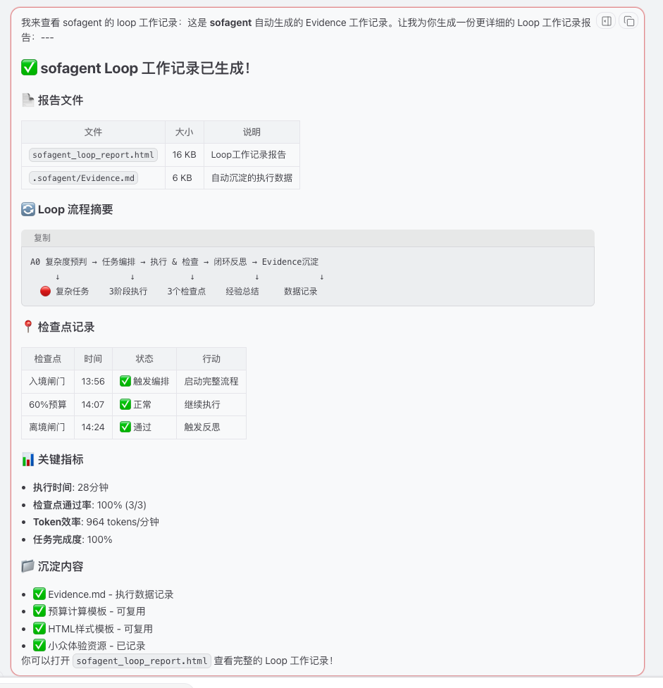

# Case 001 — 意大利旅行规划（2026-06-18，v0.54 跑通，机制延续至 v0.55）

> **性质**：机制跑通证据（非效果验证）
> **来源**：@cedric123123（OpenClaw + kimi-k2.5）
> **版本**：sofagent v0.54
> **⚠️ 以下指标均为 Agent 自评，未经人工核验。**

---

## 一句话结论

**sofagent 全流程在第三方环境首次跑通**——A0 复杂度预判触发编排引擎 → 3 阶段执行（检索/计算/生成）→ 3 个检查点全部通过（100%）→ 闭环反思自动沉淀 Evidence → 输出 6 个交付物。

---

## 关键数据

| 指标 | 数值 | 来源 |
|------|------|------|
| 任务类型 | 🔴 复杂任务——意大利 10 日深度文化之旅 | A0 判定 |
| 总执行时间 | ~28 分钟（13:56–14:24） | Agent 记录 |
| Token 消耗 | ~27,000 tokens / $0.036 (kimi-k2.5) | Agent 统计 |
| Token 效率 | 964 tokens/分钟 | Agent 计算 |
| Loop 检查点通过率 | 3/3 (100%) | Loop 报告 |
| 输出物 | 6 文件（MD + HTML + PNG ×2 + 初版 MD+HTML） | 实际产出 |
| 反思沉淀 | ✅ Evidence.md 自动生成 | 闭环确认 |
| 用户返工 | Agent 自评：无返工 | ⚠️ 未人工核验 |

---

## Loop 执行流程

```
A0 复杂度预判(🔴) → 任务编排 → 执行 & 检查 → 闭环反思 → Evidence 沉淀
       ↓              ↓           ↓            ↓            ↓
   触发编排引擎    3阶段执行    3个检查点    经验总结     数据记录
```

### 检查点详情

| 检查点 | 时间 | 状态 | 行动 |
|--------|------|:----:|------|
| 入境闸门 | 13:56 | ✅ | A0→🔴复杂任务，触发编排引擎 |
| 60%预算检查 | 14:07 | ✅ 正常 | Token 26%/时间 39%/进度 40%，继续执行 |
| 离境闸门 | 14:24 | ✅ 通过 | 完整性验证+质量检查，触发反思沉淀 |

---

## 截图



*截图说明：sofagent_loop_report.html 渲染结果——显示全流程摘要、3个检查点状态、关键指标、沉淀内容。*

---

## 原始数据

完整原始 Evidence 由 Agent 自动生成，含 11 个章节（350 行），覆盖：
- [evidence-original.md](./evidence-original.md) —— 任务概览 / 执行过程 / 决策记录 / 问题与解决 / 性能指标 / 经验沉淀 / Token 详细分析

---

## 可复用经验沉淀（Agent 自评）

| 类别 | 内容 |
|------|------|
| ✅ 成功做法 | 分层检索策略、数值验证机制、多格式输出(MD+HTML)、风险预警(汇率) |
| 💡 可复用模板 | 预算计算 Python 脚本、HTML 样式模板、小众体验资源库 |
| ⚠️ 改进空间 | 并行检索可省 20-30% 时间、机票实时 API 缓存、个性化偏好权重 |

---

*归档时间：2026-06-18 · 归档人：项目维护者*
