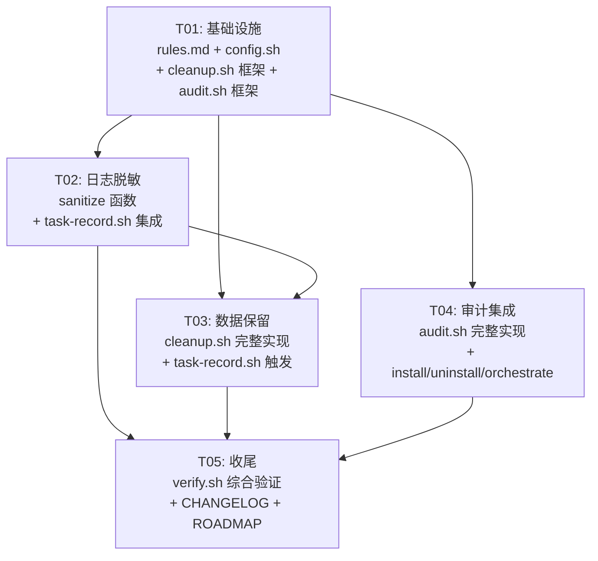

# sofagent v0.7x 企业合规功能 — 增量架构设计

> 设计者：Bob（Architect）
> 日期：2026-06-19
> 基于复审：主理人对 DEVELOPMENT.md §七、task-record.sh v0.71、ROADMAP.md v0.7x 的审查结论

---

## Part A: 系统设计

### 1. 实现方案

#### 1.1 总体策略

三项功能共享同一个设计骨架：

```
rules.md 配置段（统一开关）
       │
       ├──→ lib/config.sh（配置加载器，单次解析供所有脚本复用）
       │         │
       │         ├──→ task-record.sh ── 写前脱敏（sanitize function）
       │         │         └── 写后触发 cleanup.sh（概率抽样，非每次）
       │         │
       │         ├──→ cleanup.sh ── 独立脚本，按保留策略清理 task/logs/
       │         │
       │         └──→ audit.sh ── 独立脚本，记录关键操作到 task/audit/
       │
       └──→ 默认全关，rules.md 中逐项启用
```

核心原则：**管写入不管存储**——脱敏在写入前完成、清理在写入后触发、审计在操作时同步记录。不改造 `.sofagent/` 已有文件格式，不引入新的文件格式（纯 Markdown），不增加运行时依赖。

#### 1.2 三项功能各自落点

##### P0: 日志脱敏（Sanitization）

**实现位置**：`task-record.sh` 内部，在构建 Markdown 条目（heredoc）之前。

**核心逻辑**：
1. 从 `rules.md` 读取 `log_sanitize: true/false`
2. 若启用，对所有参数值（`TASK_NAME`、`TASK_RESULT`、`TASK_MODEL`、`TASK_SKILLS`）及 stdin 管道数据过一遍 `sanitize()` 函数
3. `sanitize()` 用 `sed` 做正则替换，覆盖三类敏感模式：
   - **API Key**：`sk-...`（OpenAI）、`sk-ant-...`（Anthropic）、`org-...`、`Bearer ...` → `sk-***REDACTED***`
   - **凭证赋值**：`password=`、`token=`、`secret=`、`api_key=`、`key=` 后的值 → `***REDACTED***`
   - **内网 IP**（可选，默认关闭）：`10.x.x.x`、`172.16-31.x.x`、`192.168.x.x` → `[INTERNAL_IP]`
4. 脱敏后的值**只影响写入**，不修改原始参数变量（保证 task-orchestrate.sh 接收方不受影响）

**为什么不放在 cleanup.sh 里事后脱敏**：
- 事后脱敏需要修改已写入的文件，违反「只追加不修改」的铁律
- 事前脱敏是唯一正确的时机——写入的那一刻就是最后一道关卡
- 与「文件系统而非数据库」哲学一致：文件一旦写入就是 immutable log

##### P0: 数据保留策略（Data Retention）

**实现位置**：新建独立脚本 `cleanup.sh`，由 `task-record.sh` 在每次写入后概率触发（默认每次写入后 1/10 概率检查，避免每次 IO）。

**核心逻辑**：
1. 从 `rules.md` 读取 `data_retention_days`（默认 90）、`data_retention_max_entries`（默认 500）
2. 两种清理模式（满足任一即触发）：
   - **按天数**：扫描 `.sofagent/task/logs/YYYY-MM/` 目录树，删除修改时间超过保留期的日志文件
   - **按条数**：统计全部日志中的 `## ` 条目总数，超过上限时从最旧的月开始删除
3. 清理操作自身写入审计日志（通过 audit.sh）
4. 清理前输出 dry-run 预览（`--dry-run` 参数），清理后输出 summary

**为什么不修改 task/logs 目录结构**：
- 现有 `YYYY-MM/YYYY-MM-DD.md` 树形结构天然按时间组织，正是清理的最佳索引粒度（按月删）
- 不需要额外的元数据文件——`find` + `stat` 就能判断文件年龄
- 条目计数用 `grep -c "^## "` 所有日志文件，bash 原生能力

##### P1: 审计日志（Audit Log）

**实现位置**：新建独立脚本 `audit.sh`，被关键操作脚本调用。

**核心逻辑**：
1. 接收参数：`--operation <操作类型>`、`--target <操作对象>`、`--result <结果>`
2. 自动采集：时间戳（ISO 8601 UTC）、当前用户（`whoami`）、主机名（`hostname`）、脚本调用者（`$0` 的 caller）
3. 输出位置：`.sofagent/task/audit/YYYY-MM/YYYY-MM-DD.md`
4. 格式：纯追加 Markdown 表格行
5. 调用点：

| 调用方 | 操作类型 | 触发时机 |
|--------|----------|----------|
| `install.sh` | `install` | 安装开始 + 安装完成 |
| `uninstall.sh` | `uninstall` | 卸载开始 + 卸载完成 |
| `task-orchestrate.sh` | `orchestrate` | 编排开始 + 编排结束（含级别、任务摘要） |
| `cleanup.sh` | `cleanup` | 清理执行（含删除文件数） |
| `task-record.sh` | `record` | (可选) 每次任务记录（默认关闭，避免日志膨胀） |

**审计日志与 task/logs 的区别**：
- task/logs 记录 **Agent 做了什么**（任务维度的执行记录）
- task/audit 记录 **人/系统做了什么**（操作维度的合规审计）
- 两者互补，不互相替代

---

### 2. 文件变更清单

#### 2.1 新建文件

| 文件路径 | 职责 | 行数估计 |
|----------|------|----------|
| `sofagent/scripts/cleanup.sh` | 数据保留清理脚本：读取配置 → 扫描日志目录 → 按天/按条清理 → 审计记录 | ~120 行 |
| `sofagent/scripts/audit.sh` | 审计日志脚本：接收操作参数 → 采集上下文 → 追加 Markdown 到 `task/audit/` | ~80 行 |
| `sofagent/scripts/lib/config.sh` | 共享配置加载器：从 `rules.md` 解析企业合规配置项，输出环境变量供所有脚本 `source` | ~50 行 |

#### 2.2 修改文件

| 文件路径 | 改动内容 | 改动量 |
|----------|----------|--------|
| `sofagent/constitution/rules.md` | 新增「企业合规」配置段（6 个配置项，注释状态） | +25 行 |
| `sofagent/scripts/task-record.sh` | (1) 新增 `sanitize()` 函数 (2) 写入前调用脱敏 (3) 写入后概率触发 cleanup.sh | +40 行 |
| `sofagent/scripts/install.sh` | Step 开始/结束时调用 `audit.sh --operation install` | +8 行 |
| `sofagent/scripts/uninstall.sh` | Step 开始/结束时调用 `audit.sh --operation uninstall` | +8 行 |
| `sofagent/scripts/task-orchestrate.sh` | 编排开始/结束时调用 `audit.sh --operation orchestrate` | +8 行 |
| `sofagent/scripts/verify.sh` | 新增脱敏/清理/审计三项验证用例 | +30 行 |

#### 2.3 不影响文件

以下文件**不做任何修改**：
- `.sofagent/task/logs/` 目录下的所有已有日志（不做事后脱敏、不修改格式）
- `think.md`（数据保留策略不涉及反思区——think.md 有自身的权重门禁 + 2K token 硬上限）
- `scoring/`、`orchestrator/` 目录
- `HOOK.md`、`handler.ts`
- 所有 Skill .md 文件

---

### 3. 数据结构设计

#### 3.1 rules.md 新增配置段

```markdown
## 企业合规（v0.7x，可选）

<!-- 去掉对应行 # 启用。所有功能默认关闭，不影响现有用户。 -->

# 日志脱敏：写入 task/logs 前自动打码 API Key / token / 密码
# log_sanitize: true
# log_sanitize_ips: false

# 数据保留：超过保留天数或条数上限自动清理
# data_retention_days: 90
# data_retention_max_entries: 500
# data_cleanup_on_record: true

# 审计日志：记录关键操作（install / uninstall / orchestrate / cleanup）
# audit_enabled: true
```

#### 3.2 配置加载器输出格式

`lib/config.sh` 被 `source` 后，输出以下环境变量（未启用时为空字符串）：

| 环境变量 | 类型 | 默认值 | 说明 |
|----------|------|--------|------|
| `SOFA_SANITIZE` | `true\|""` | `""` | 是否启用脱敏 |
| `SOFA_SANITIZE_IPS` | `true\|""` | `""` | 是否脱敏内网 IP |
| `SOFA_RETENTION_DAYS` | 数字 | `90` | 日志保留天数 |
| `SOFA_RETENTION_MAX` | 数字 | `500` | 日志最大条数 |
| `SOFA_CLEANUP_ON_RECORD` | `true\|""` | `""` | 写日志后是否自动触发清理 |
| `SOFA_AUDIT_ENABLED` | `true\|""` | `""` | 是否启用审计日志 |

#### 3.3 审计日志文件格式

新增 `.sofagent/task/audit/YYYY-MM/YYYY-MM-DD.md`：

```markdown
# 2026-06-19 审计记录

| 时间 (UTC) | 操作 | 对象 | 结果 | 用户 | 主机 | 详情 |
|------------|------|------|------|------|------|------|
| 14:32:01 | install | openclaw | 成功 | kongfangxun | MacBook-Pro | v1.1.0, 7 steps |
| 14:35:22 | orchestrate | "重构用户模块" | 成功 | kongfangxun | MacBook-Pro | L2 模板复用, 耗时 45s |
| 14:40:15 | cleanup | task/logs/2026-02/ | 成功 | kongfangxun | MacBook-Pro | 删除 3 个文件, 45 条记录 |
```

#### 3.4 脱敏规则格式

脱敏规则定义在 `task-record.sh` 的 `sanitize()` 函数中，用 `sed` 链式替换：

```bash
# 脱敏规则（sed 正则链）
# 优先级：API Key > Token/Credential > 内网 IP
sanitize() {
  local input="$1"
  # 1. OpenAI / Anthropic API Key
  input=$(echo "$input" | sed -E 's/sk-(ant(-api)?-)?[a-zA-Z0-9_-]{20,}/sk-***REDACTED***/g')
  # 2. Bearer token
  input=$(echo "$input" | sed -E 's/Bearer +[a-zA-Z0-9._~+/-]+=*/Bearer ***REDACTED***/g')
  # 3. 凭证赋值（password= / token= / secret= / key= / api_key=）
  input=$(echo "$input" | sed -E 's/(password|token|secret|api_key|key)[=:]\s*[^ ]+/\1=***REDACTED***/g')
  # 4. 内网 IP（可选，SOFA_SANITIZE_IPS=true 时启用）
  if [ "${SOFA_SANITIZE_IPS:-}" = "true" ]; then
    input=$(echo "$input" | sed -E 's/\b(10\.|172\.(1[6-9]|2[0-9]|3[01])\.|192\.168\.)[0-9]+\.[0-9]+\b/[INTERNAL_IP]/g')
  fi
  echo "$input"
}
```

---

### 4. 程序调用流

#### 4.1 任务记录 + 脱敏 + 清理触发（核心闭环）

```
task-orchestrate.sh 完成任务
  │
  └─→ task-record.sh --task "重构用户模块" --result "成功" --model deepseek-v4 --skills "orchestrate-L2"
        │
        ├─→ source lib/config.sh           # 加载合规配置
        │
        ├─→ [log_sanitize=true]
        │     └─→ sanitize("$TASK_NAME")   # 脱敏所有参数
        │         sanitize("$TASK_RESULT")
        │         sanitize("$TASK_MODEL")
        │         sanitize("$TASK_SKILLS")
        │
        ├─→ 构建 Markdown 条目（脱敏后值）
        ├─→ cat << ENTRY >> LOG_FILE       # 追加写入（脱敏后内容）
        │
        ├─→ [audit_enabled=true && 非每次]
        │     └─→ audit.sh --operation record --target "$TASK_NAME" --result "$TASK_RESULT"
        │
        └─→ [cleanup_on_record=true && 概率触发(1/10)]
              └─→ cleanup.sh
                    ├─→ source lib/config.sh
                    ├─→ 扫描 task/logs/ 目录
                    ├─→ [超过保留天数] → 删除旧日志文件
                    ├─→ [超过条数上限] → 从最旧月开始删除
                    ├─→ audit.sh --operation cleanup --target "task/logs/" --result "删除 N 个文件"
                    └─→ 输出清理摘要
```

#### 4.2 安装/卸载审计流

```
install.sh
  ├─→ Step 1: audit.sh --operation install --target "开始" --result "v${VERSION}, ${PLATFORM}"
  ├─→ Step 2-7: ...
  └─→ Step 7: audit.sh --operation install --target "完成" --result "成功"

uninstall.sh
  ├─→ audit.sh --operation uninstall --target "开始"
  ├─→ ...
  └─→ audit.sh --operation uninstall --target "完成" --result "成功"
```

#### 4.3 编排审计流

```
task-orchestrate.sh
  ├─→ audit.sh --operation orchestrate --target "$TASK_DESC" --result "开始, L${LEVEL}"
  ├─→ (编排执行) ...
  └─→ audit.sh --operation orchestrate --target "$TASK_DESC" --result "$([$EXIT_CODE -eq 0] && echo '成功' || echo '失败'), L${LEVEL}, ${ELAPSED}s"
```

---

### 5. 待明确事项

| # | 问题 | 当前假设 | 影响 |
|---|------|----------|------|
| 1 | `data_retention_days: 90` 是否过短/过长？ | 按 ROADMAP 默认 90 天 | 可调整，不影响设计 |
| 2 | 清理删除的文件是否需要先归档（tar.gz）再删？ | 当前设计直接删除，不归档 | 如需要归档，cleanup.sh 加 `--archive` 参数 |
| 3 | 审计日志中 `task-record` 操作默认关闭——是否需要对每次任务记录也做审计？ | 默认关闭，避免条目与 task/logs 重复且翻倍膨胀 | 如需要，改 `audit_enabled` 即可，但需在 rules.md 注释中说明代价 |
| 4 | think.md 是否也需要脱敏？ | 当前不处理——think.md 是 LLM 生成的反思摘要，不是原始日志数据。且反思区有 2K token 硬上限 | 如企业环境需要，可在 loop-check.md closure 模式中引用 sanitize 函数 |
| 5 | 清理触发概率（1/10）是否合理？ | 1/10 = 平均每 10 次任务记录触发一次清理检查。避免每次 IO，但不超过一天不清理 | 可设为 `data_cleanup_frequency: 10` 配置项 |

---

## Part B: 任务分解

### 6. 依赖包列表

```
无新增依赖。全部使用 bash 内置 + 已有依赖：
- bash ≥3.2（macOS 默认）
- sed（POSIX，所有平台内置）
- grep（POSIX，所有平台内置）
- find（POSIX，所有平台内置）
- whoami / hostname / date（POSIX，所有平台内置）
- jq（可选，仅 --from-stdin 路径需要，已列在项目现有依赖中）
```

### 7. 任务列表（按依赖顺序）

---

#### T01: 项目基础设施 — rules.md 配置段 + 共享配置加载器 + 脚本框架

| 字段 | 内容 |
|------|------|
| **Task ID** | T01 |
| **任务名称** | 企业合规基础设施：配置段 + config.sh + 脚本框架 |
| **源文件** | `sofagent/constitution/rules.md`（修改，追加合规配置段） `sofagent/scripts/lib/config.sh`（新建） `sofagent/scripts/cleanup.sh`（新建，框架 + 参数解析 + --help） `sofagent/scripts/audit.sh`（新建，框架 + 参数解析 + --help） |
| **依赖** | 无 |
| **优先级** | P0 |
| **工作内容** | 1. 在 rules.md 末尾追加「企业合规」配置段，6 个配置项默认注释 2. 创建 `lib/config.sh`：解析 rules.md 中的 `key: value` 行，export 为环境变量 3. 创建 `cleanup.sh` 框架：参数解析（`--dry-run`、`--force`、`--help`、`--version`）、路径初始化 4. 创建 `audit.sh` 框架：参数解析（`--operation`、`--target`、`--result`、`--help`）、路径初始化（`task/audit/` 目录创建）、Markdown 表头写入、时间戳/用户/主机采集 |

---

#### T02: 日志脱敏实现 — sanitize 函数 + task-record.sh 集成

| 字段 | 内容 |
|------|------|
| **Task ID** | T02 |
| **任务名称** | 日志脱敏：sanitize 函数 + task-record.sh 写前脱敏集成 |
| **源文件** | `sofagent/scripts/task-record.sh`（修改：新增 sanitize() + 写入前调用 + source config.sh） `sofagent/scripts/verify.sh`（修改：新增脱敏验证用例） `sofagent/scripts/lib/config.sh`（修改：增加 sanitize 配置项读取） |
| **依赖** | T01（rules.md 配置段 + config.sh 框架） |
| **优先级** | P0 |
| **工作内容** | 1. 在 task-record.sh 中新增 `sanitize()` 函数（sed 链式替换，四层规则） 2. 在 task-record.sh 中 `source lib/config.sh` 读取 `SOFA_SANITIZE` 3. 在 heredoc 写入前，对所有参数变量调用 `sanitize()`，使用局部变量保存脱敏后值 4. 确保原始参数变量不被修改（task-orchestrate.sh 调用方不受影响） 5. `--from-stdin` 路径同样过脱敏 6. verify.sh 新增 3 个脱敏测试：sk- 前缀 key → `sk-***REDACTED***`、`password=xxx` → `password=***REDACTED***`、未启用时参数原样通过 |

---

#### T03: 数据保留策略实现 — cleanup.sh 完整清理逻辑 + task-record.sh 触发

| 字段 | 内容 |
|------|------|
| **Task ID** | T03 |
| **任务名称** | 数据保留策略：cleanup.sh 完整实现 + task-record.sh 触发集成 |
| **源文件** | `sofagent/scripts/cleanup.sh`（完善：扫描 + 按天清理 + 按条清理 + 摘要输出） `sofagent/scripts/task-record.sh`（修改：写入后概率触发 cleanup.sh） `sofagent/scripts/verify.sh`（修改：新增清理验证用例） |
| **依赖** | T01（cleanup.sh 框架、config.sh）、T02（task-record.sh 已集成 config.sh source） |
| **优先级** | P0 |
| **工作内容** | 1. cleanup.sh 实现扫描逻辑：`find .sofagent/task/logs/ -name "*.md"` 按修改时间排序 2. 实现按天清理：`find -mtime +${SOFA_RETENTION_DAYS}` 删除旧文件 3. 实现按条清理：`grep -c "^## "` 所有日志文件 → 超过 `SOFA_RETENTION_MAX` 时从最旧月开始逐月删除 4. `--dry-run` 模式只输出预览不删除 5. 清理操作写入审计日志（调用 audit.sh） 6. task-record.sh 末尾：`SOFA_CLEANUP_ON_RECORD=true` 且 `$((RANDOM % 10 == 0))` 时触发 `cleanup.sh` 7. verify.sh 新增清理测试：dry-run 输出格式验证、模拟旧文件创建后清理验证 |

---

#### T04: 审计日志全集成 — audit.sh 完整实现 + install/uninstall/orchestrate 调用

| 字段 | 内容 |
|------|------|
| **Task ID** | T04 |
| **任务名称** | 审计日志全集成：audit.sh 完整实现 + 三个调用方集成 |
| **源文件** | `sofagent/scripts/audit.sh`（完善：Markdown 表格追加 + 上下文采集 + 错误处理） `sofagent/scripts/install.sh`（修改：Step 开始/结束处调用 audit.sh） `sofagent/scripts/uninstall.sh`（修改：操作开始/结束处调用 audit.sh） `sofagent/scripts/task-orchestrate.sh`（修改：编排开始/结束处调用 audit.sh） |
| **依赖** | T01（audit.sh 框架、config.sh） |
| **优先级** | P1 |
| **工作内容** | 1. audit.sh 完整实现：`--operation`/`--target`/`--result` 参数 → 拼接 Markdown 表格行 → `cat << ROW >> LOG_FILE` 2. audit.sh 自动采集：`date -u +"%H:%M:%S"`（UTC）、`whoami`、`hostname` 3. audit.sh 错误处理：审计写入失败不阻塞主流程（`|| true` 兜底） 4. install.sh：Step 1 之前 + Step 7 之后各调用一次 audit.sh 5. uninstall.sh：操作开始 + 操作结束各调用一次 audit.sh 6. task-orchestrate.sh：`ao compose` 之前 + `_exit_orchestrate` 之前各调用一次 audit.sh（通过 `SOFA_AUDIT_ENABLED` 开关控制） 7. 所有 audit.sh 调用使用 `|| true` 确保审计失败不影响主流程 |

---

#### T05: 收尾 — verify.sh 综合验证 + CHANGELOG + ROADMAP 更新

| 字段 | 内容 |
|------|------|
| **Task ID** | T05 |
| **任务名称** | 收尾验证：verify.sh 综合检查 + 文档更新 |
| **源文件** | `sofagent/scripts/verify.sh`（修改：新增合规三项综合验证用例） `CHANGELOG.md`（修改：v0.70.0 条目） `ROADMAP.md`（修改：v0.7x 三项标记为已完成 ✅） |
| **依赖** | T02（脱敏可用）、T03（清理可用）、T04（审计可用） |
| **优先级** | P1 |
| **工作内容** | 1. verify.sh 新增「企业合规」检查组：脱敏函数验证、cleanup.sh dry-run 验证、audit.sh 写入验证 2. verify.sh 新增「默认关闭」检查：确认未配置时三项功能均不生效 3. CHANGELOG.md：v0.70.0 条目说明三项新增功能 4. ROADMAP.md：v0.7x 三项状态从 🚧 更新为 ✅ |

---

### 8. 共享知识

```
─ 配置加载机制 ─
  所有脚本通过 source lib/config.sh 读取合规配置。
  config.sh 用 grep + sed 从 rules.md 提取 key: value 行，不依赖 jq。
  配置项格式严格为 "# key: value"（注释状态下），启用后为 "key: value"。
  空值/未配置 → 使用硬编码默认值（90 天、500 条、功能关闭）。

─ 脱敏规则优先级 ─
  API Key > Bearer Token > 凭证赋值(password/token/secret/key/api_key) > 内网 IP
  脱敏使用 sed 正则替换，匹配失败时保留原值（不丢数据）。

─ 审计日志写入容错 ─
  所有 audit.sh 调用必须用 || true 兜底。
  审计写入失败绝不能阻塞主流程（install/uninstall/orchestrate/cleanup）。
  audit.sh 自身也包含 set -euo pipefail 但主流程用 || true 隔离。

─ 清理安全边界 ─
  cleanup.sh 只操作 .sofagent/task/logs/ 目录。
  不触碰 think.md、scoring/、orchestrator/、hooks/。
  --dry-run 模式为默认安全网，--force 才真正删除。

─ 向后兼容 ─
  所有新功能默认关闭（rules.md 中注释状态）。
  不修改 .sofagent/ 已有文件格式。
  不修改 task-record.sh 的 CLI 接口（参数和行为不变）。
  已有用户升级后行为完全不变，直到主动编辑 rules.md 启用。

─ 文件权限 ─
  lib/config.sh: 644（可读，不可执行，仅被 source）
  cleanup.sh: 755（可执行）
  audit.sh: 755（可执行）
  task/audit/ 目录：由 audit.sh 首次运行时 mkdir -p 创建，继承 .sofagent/ 的 700 权限

─ 时间格式 ─
  审计日志时间戳：UTC（date -u +"%H:%M:%S"）
  日志文件路径：本地日期（date +"%Y-%m" / "%Y-%m-%d"）
  文件修改时间判断：使用 find -mtime（POSIX，以天为单位）
```

### 9. 任务依赖图



---

> 设计完成。三个功能共享配置层、各自独立实现、通过概率触发和开关控制耦合度。最坏情况下（新功能全部关闭），对现有系统的影响为零行有效代码。
